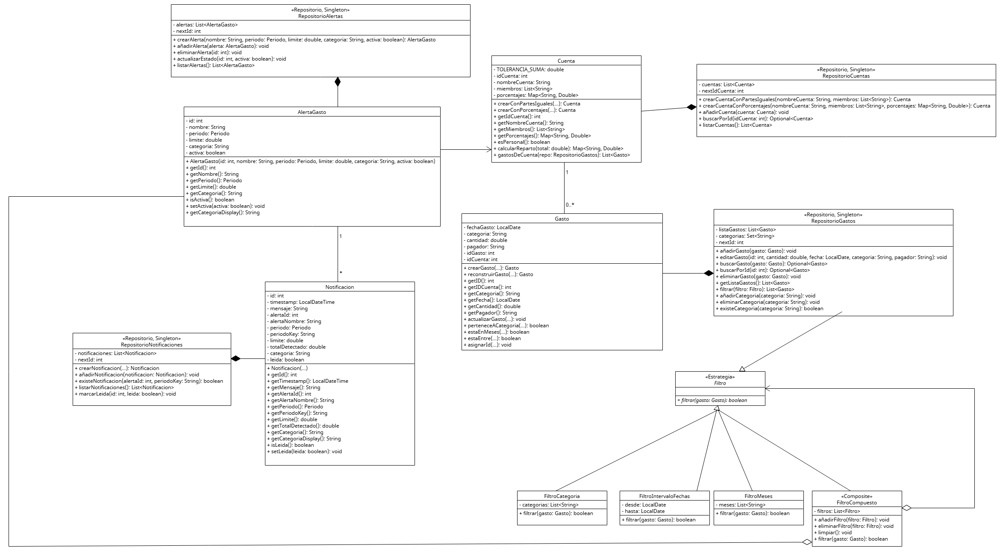

# Diagrama UML de clases 



- [Diagrama UML de clases](#diagrama-uml-de-clases)
- [1. Diagrama](#1-diagrama)
- [2. Qué clases aparecen](#2-qué-clases-aparecen)
- [3. Qué clases no aparecen](#3-qué-clases-no-aparecen)
- [4. Clases del paquete `domain`](#4-clases-del-paquete-domain)
    - [4.1. Clase `Gasto`](#41-clase-gasto)
    - [4.2. Clase `Cuenta`](#42-clase-cuenta)
    - [4.3. Clase `AlertaGasto`](#43-clase-alertagasto)
    - [4.4. Clase `Notificacion`](#44-clase-notificacion)
    - [4.5. Enum `Periodo`](#45-enum-periodo)
- [5. Clases del paquete `repo`](#5-clases-del-paquete-repo)
    - [5.1. `RepositorioGastos`](#51-repositoriogastos)
    - [5.2. `RepositorioCuentas`](#52-repositoriocuentas)
    - [5.3. `RepositorioAlertas`](#53-repositorioalertas)
    - [5.4. `RepositorioNotificaciones`](#54-repositorionotificaciones)
- [6. Clases del paquete `filtros`](#6-clases-del-paquete-filtros)
    - [6.1. Clase abstracta o interfaz `Filtro`](#61-clase-abstracta-o-interfaz-filtro)
    - [6.2. `FiltroCategoria`](#62-filtrocategoria)
    - [6.3. `FiltroMeses`](#63-filtromeses)
    - [6.4. `FiltroIntervaloFechas`](#64-filtrointervalofechas)
    - [6.5. `FiltroCompuesto`](#65-filtrocompuesto)
- [7. Clases del paquete `application`](#7-clases-del-paquete-application)
    - [7.1. `RegistrarGastoUseCase`](#71-registrargastousecase)
    - [7.2. `ModificarGastoUseCase`](#72-modificargastousecase)
    - [7.3. `BorrarGastoUseCase`](#73-borrargastousecase)
- [8. Clase del paquete `service`](#8-clase-del-paquete-service)
    - [8.1. `AlertaService`](#81-alertaservice)
- [9. Relaciones UML del dominio](#9-relaciones-uml-del-dominio)
- [10. Relaciones UML de repositorios](#10-relaciones-uml-de-repositorios)
- [11. Relaciones UML de filtros](#11-relaciones-uml-de-filtros)
- [12. Relaciones UML de casos de uso](#12-relaciones-uml-de-casos-de-uso)
- [13. Relaciones UML de `AlertaService`](#13-relaciones-uml-de-alertaservice)
- [14. Resumen final de relaciones](#14-resumen-final-de-relaciones)
- [15. Leyenda UML que debe usarse](#15-leyenda-uml-que-debe-usarse)

---

En este documento indicamos, paso a paso, cómo construir el **diagrama UML de clases ampliado** del proyecto **BanCroak**. 

El diagrama incluye:

- clases principales del dominio;
- repositorios;
- filtros;
- casos de uso;
- servicio de alertas;
- relaciones entre todas ellas;
- multiplicidades;
- tipo de relación UML;
- justificación de cada decisión.

---

## 1. Diagrama

Para no mezclar demasiadas responsabilidades, organizamos el diagrama por paquetes:

| Paquete UML | Contenido |
|---|---|
| `domain` | Entidades principales del dominio: `Gasto`, `Cuenta`, `AlertaGasto`, `Notificacion` y el enum `Periodo`. |
| `repo` | Repositorios que almacenan y consultan objetos del dominio. |
| `filtros` | Jerarquía de filtros para consultar gastos. |
| `application` | Casos de uso de la aplicación. |
| `service` | Servicio de alertas. |

---

## 2. Qué clases aparecen

En el diagrama aparecen las siguientes clases:

| Clase | Paquete | Estereotipo UML | Motivo |
|---|---|---|---|
| `Gasto` | `domain` | `<<Entity>>` | Representa un gasto con identidad propia mediante `idGasto`. |
| `Cuenta` | `domain` | `<<Entity>>` | Representa una cuenta con identidad propia mediante `idCuenta`. |
| `AlertaGasto` | `domain` | `<<Entity>>` | Representa una alerta configurable de gasto. |
| `Notificacion` | `domain` | `<<Entity>>` | Representa una notificación generada por una alerta. |
| `Periodo` | `domain` | `<<enum>>` | Define los periodos posibles de una alerta: semanal o mensual. |
| `RepositorioGastos` | `repo` | `<<Repository, Singleton>>` | Almacena y gestiona gastos. |
| `RepositorioCuentas` | `repo` | `<<Repository, Singleton>>` | Almacena y gestiona cuentas. |
| `RepositorioAlertas` | `repo` | `<<Repository, Singleton>>` | Almacena y gestiona alertas. |
| `RepositorioNotificaciones` | `repo` | `<<Repository, Singleton>>` | Almacena y gestiona notificaciones. |
| `Filtro` | `filtros` | `<<Strategy>>` | Clase abstracta o interfaz base para filtrar gastos. |
| `FiltroCategoria` | `filtros` | `<<Strategy>>` | Filtro concreto por categoría. |
| `FiltroMeses` | `filtros` | `<<Strategy>>` | Filtro concreto por meses. |
| `FiltroIntervaloFechas` | `filtros` | `<<Strategy>>` | Filtro concreto por intervalo de fechas. |
| `FiltroCompuesto` | `filtros` | `<<Composite>>` | Combina varios filtros. |
| `RegistrarGastoUseCase` | `application` | `<<ApplicationService>>` | Caso de uso para registrar gastos. |
| `ModificarGastoUseCase` | `application` | `<<ApplicationService>>` | Caso de uso para modificar gastos. |
| `BorrarGastoUseCase` | `application` | `<<ApplicationService>>` | Caso de uso para borrar gastos. |
| `AlertaService` | `service` | `<<Service>>` | Servicio que evalúa alertas y genera notificaciones. |

---

## 3. Qué clases no aparecen

Para que el diagrama no quede demasiado cargado, no incluimos clases de interfaz gráfica, consola ni persistencia interna.

| Clase o paquete | Motivo para no incluirlo |
|---|---|
| `ui.*` | Son clases de interfaz gráfica, no forman parte del modelo principal de dominio. |
| `cli.MainCLI` | Pertenece a la entrada por consola, no al dominio. |
| `App`, `SceneManager`, `AppContext` | Son clases de arranque o coordinación técnica. |
| `GastosStore` | Es una clase auxiliar de interfaz/estado, no del dominio central. |
| `persistence.*` | Son detalles de almacenamiento. Se representan mejor mediante repositorios. |
| Clases internas `*Data` | Son DTOs o estructuras auxiliares para persistencia. |
| `FilterState` | Estado auxiliar de filtros en interfaz. |
| `CuentaTipo` | Solo debe aparecer si el profesor exige todos los tipos auxiliares; si no, se omite. |
| `VisualizarTab` | Pertenece a interfaz gráfica. |
| `DayAggregate` | Clase auxiliar de visualización/agregación. |
| `RepartoRow`, `MiembroPorcentajeRow`, `GastoImportado` | Clases auxiliares de UI o importación. |

---

# 4. Clases del paquete `domain`

## 4.1. Clase `Gasto`

### Tipo UML

`Gasto` debe aparecer como:

```text
Gasto <<Entity>>
```

Es una entidad porque tiene identidad propia mediante `idGasto`. Dos gastos se consideran iguales si tienen el mismo identificador.

### Atributos

| Visibilidad | Atributo | Tipo | Explicación |
|---|---|---|---|
| `-` | `fechaGasto` | `LocalDate` | Fecha en la que se realizó el gasto. |
| `-` | `categoria` | `String` | Categoría del gasto, por ejemplo comida, transporte, ocio, etc. |
| `-` | `cantidad` | `double` | Importe del gasto. |
| `-` | `pagador` | `String` | Persona que pagó el gasto. |
| `-` | `idGasto` | `int` | Identificador único del gasto. |
| `-` | `idCuenta` | `int` | Identificador de la cuenta a la que pertenece el gasto. |

### Métodos principales

| Visibilidad | Método | Retorno | Explicación |
|---|---|---|---|
| `-` | `Gasto(cantidad: double, fecha: LocalDate, categoria: String, pagador: String, idCuenta: int)` | constructor | Constructor privado. Obliga a crear gastos mediante métodos factoría. |
| `+` | `crearGasto(cantidad: double, fecha: LocalDate, categoria: String, pagador: String, idCuenta: int)` | `Gasto` | Crea un gasto nuevo sin id asignado todavía. |
| `+` | `reconstruirGasto(cantidad: double, fecha: LocalDate, categoria: String, pagador: String, idCuenta: int, idGasto: int)` | `Gasto` | Reconstruye un gasto ya existente, por ejemplo desde JSON. |
| `+` | `getID()` | `int` | Devuelve el id del gasto. |
| `+` | `getIDCuenta()` | `int` | Devuelve el id de la cuenta asociada. |
| `+` | `getCategoria()` | `String` | Devuelve la categoría. |
| `+` | `getFecha()` | `LocalDate` | Devuelve la fecha. |
| `+` | `getCantidad()` | `double` | Devuelve la cantidad. |
| `+` | `getPagador()` | `String` | Devuelve el pagador. |
| `+` | `actualizarGasto(cantidad: double, fecha: LocalDate, categoria: String, pagador: String)` | `void` | Modifica los datos del gasto sin cambiar su id ni su cuenta. |
| `+` | `perteneceACategoria(categoria: String)` | `boolean` | Comprueba si el gasto pertenece a una categoría. |
| `+` | `estaEnMeses(meses: List<String>)` | `boolean` | Comprueba si el gasto está en alguno de los meses dados. |
| `+` | `estaEntre(desde: LocalDate, hasta: LocalDate)` | `boolean` | Comprueba si la fecha está dentro de un intervalo. |
| `+` | `asignarId(id: int)` | `void` | Asigna el id generado por el repositorio. |

### En el dibujo

Dentro de la caja UML de `Gasto`, se ponen tres zonas:

```text
Gasto <<Entity>>
-----------------------------
- fechaGasto: LocalDate
- categoria: String
- cantidad: double
- pagador: String
- idGasto: int
- idCuenta: int
-----------------------------
+ crearGasto(...): Gasto
+ reconstruirGasto(...): Gasto
+ getID(): int
+ getIDCuenta(): int
+ getCategoria(): String
+ getFecha(): LocalDate
+ getCantidad(): double
+ getPagador(): String
+ actualizarGasto(...): void
+ perteneceACategoria(...): boolean
+ estaEnMeses(...): boolean
+ estaEntre(...): boolean
+ asignarId(...): void
```

---

## 4.2. Clase `Cuenta`

### Tipo UML

`Cuenta` debe aparecer como:

```text
Cuenta <<Entity>>
```

Es una entidad porque tiene identidad propia mediante `idCuenta`.

### Atributos

| Visibilidad | Atributo | Tipo | Explicación |
|---|---|---|---|
| `-` | `TOLERANCIA_SUMA` | `double` | Constante usada para validar que los porcentajes suman 100. |
| `-` | `idCuenta` | `int` | Identificador único de la cuenta. |
| `-` | `nombreCuenta` | `String` | Nombre de la cuenta. |
| `-` | `miembros` | `List<String>` | Lista de miembros de la cuenta. |
| `-` | `porcentajes` | `Map<String, Double>` | Porcentaje que corresponde a cada miembro. |

### Métodos principales

| Visibilidad | Método | Retorno | Explicación |
|---|---|---|---|
| `-` | `Cuenta(idCuenta: int, nombreCuenta: String, miembros: List<String>, porcentajes: Map<String, Double>)` | constructor | Constructor privado. La clase se crea mediante métodos factoría. |
| `+` | `crearConPartesIguales(idCuenta: int, nombreCuenta: String, miembros: List<String>)` | `Cuenta` | Crea una cuenta repartiendo porcentajes por igual. |
| `+` | `crearConPorcentajes(idCuenta: int, nombreCuenta: String, miembros: List<String>, porcentajes: Map<String, Double>)` | `Cuenta` | Crea una cuenta con porcentajes personalizados. |
| `+` | `getIdCuenta()` | `int` | Devuelve el id de la cuenta. |
| `+` | `getNombreCuenta()` | `String` | Devuelve el nombre. |
| `+` | `getMiembros()` | `List<String>` | Devuelve los miembros. |
| `+` | `getPorcentajes()` | `Map<String, Double>` | Devuelve el reparto porcentual. |
| `+` | `esPersonal()` | `boolean` | Indica si la cuenta solo tiene un miembro. |
| `+` | `calcularReparto(total: double)` | `Map<String, Double>` | Calcula cuánto corresponde pagar a cada miembro. |
| `+` | `gastosDeCuenta(repo: RepositorioGastos)` | `List<Gasto>` | Obtiene los gastos asociados a esta cuenta usando el repositorio. |

### En el dibujo

```text
Cuenta <<Entity>>
-----------------------------
- TOLERANCIA_SUMA: double
- idCuenta: int
- nombreCuenta: String
- miembros: List<String>
- porcentajes: Map<String, Double>
-----------------------------
+ crearConPartesIguales(...): Cuenta
+ crearConPorcentajes(...): Cuenta
+ getIdCuenta(): int
+ getNombreCuenta(): String
+ getMiembros(): List<String>
+ getPorcentajes(): Map<String, Double>
+ esPersonal(): boolean
+ calcularReparto(total: double): Map<String, Double>
+ gastosDeCuenta(repo: RepositorioGastos): List<Gasto>
```

---

## 4.3. Clase `AlertaGasto`

### Tipo UML

```text
AlertaGasto <<Entity>>
```

Representa una alerta que avisa cuando el gasto supera cierto límite.

### Atributos

| Visibilidad | Atributo | Tipo | Explicación |
|---|---|---|---|
| `-` | `id` | `int` | Identificador de la alerta. |
| `-` | `nombre` | `String` | Nombre descriptivo de la alerta. |
| `-` | `periodo` | `Periodo` | Periodo de evaluación de la alerta. |
| `-` | `limite` | `double` | Cantidad máxima permitida. |
| `-` | `categoria` | `String` | Categoría a la que se aplica la alerta. Puede ser nula si se aplica a todas. |
| `-` | `activa` | `boolean` | Indica si la alerta está activa. |

### Métodos principales

| Visibilidad | Método | Retorno | Explicación |
|---|---|---|---|
| `+` | `AlertaGasto(id: int, nombre: String, periodo: Periodo, limite: double, categoria: String, activa: boolean)` | constructor | Crea una alerta de gasto. |
| `+` | `getId()` | `int` | Devuelve el id de la alerta. |
| `+` | `getNombre()` | `String` | Devuelve el nombre. |
| `+` | `getPeriodo()` | `Periodo` | Devuelve el periodo. |
| `+` | `getLimite()` | `double` | Devuelve el límite. |
| `+` | `getCategoria()` | `String` | Devuelve la categoría. |
| `+` | `isActiva()` | `boolean` | Indica si está activa. |
| `+` | `setActiva(activa: boolean)` | `void` | Activa o desactiva la alerta. |
| `+` | `getCategoriaDisplay()` | `String` | Devuelve la categoría o `todas` si no hay una concreta. |

---

## 4.4. Clase `Notificacion`

### Tipo UML

```text
Notificacion <<Entity>>
```

Representa un aviso generado por una alerta de gasto.

### Atributos

| Visibilidad | Atributo | Tipo | Explicación |
|---|---|---|---|
| `-` | `id` | `int` | Identificador de la notificación. |
| `-` | `timestamp` | `LocalDateTime` | Momento en el que se creó la notificación. |
| `-` | `mensaje` | `String` | Texto de la notificación. |
| `-` | `alertaId` | `int` | Id de la alerta que generó la notificación. |
| `-` | `alertaNombre` | `String` | Nombre de la alerta asociada. |
| `-` | `periodo` | `Periodo` | Periodo evaluado. |
| `-` | `periodoKey` | `String` | Clave del periodo concreto. |
| `-` | `limite` | `double` | Límite de la alerta. |
| `-` | `totalDetectado` | `double` | Total de gasto detectado. |
| `-` | `categoria` | `String` | Categoría de gasto asociada. |
| `-` | `leida` | `boolean` | Indica si la notificación ya fue leída. |

### Métodos principales

| Visibilidad | Método | Retorno | Explicación |
|---|---|---|---|
| `+` | `Notificacion(...)` | constructor | Crea una notificación. |
| `+` | `getId()` | `int` | Devuelve el id. |
| `+` | `getTimestamp()` | `LocalDateTime` | Devuelve fecha y hora. |
| `+` | `getMensaje()` | `String` | Devuelve el mensaje. |
| `+` | `getAlertaId()` | `int` | Devuelve el id de la alerta. |
| `+` | `getAlertaNombre()` | `String` | Devuelve el nombre de la alerta. |
| `+` | `getPeriodo()` | `Periodo` | Devuelve el periodo. |
| `+` | `getPeriodoKey()` | `String` | Devuelve la clave del periodo. |
| `+` | `getLimite()` | `double` | Devuelve el límite. |
| `+` | `getTotalDetectado()` | `double` | Devuelve el total detectado. |
| `+` | `getCategoria()` | `String` | Devuelve la categoría. |
| `+` | `getCategoriaDisplay()` | `String` | Devuelve categoría o `todas`. |
| `+` | `isLeida()` | `boolean` | Indica si está leída. |
| `+` | `setLeida(leida: boolean)` | `void` | Marca la notificación como leída o no leída. |

---

## 4.5. Enum `Periodo`

### Tipo UML

```text
Periodo <<enum>>
```

### Valores

| Valor | Significado |
|---|---|
| `SEMANAL` | La alerta se evalúa por semana. |
| `MENSUAL` | La alerta se evalúa por mes. |

---

# 5. Clases del paquete `repo`

Los repositorios se representan con el estereotipo:

```text
<<Repository, Singleton>>
```

Se usan para guardar, buscar, listar y modificar entidades del dominio.

---

## 5.1. `RepositorioGastos`

### Atributos

| Visibilidad | Atributo | Tipo | Explicación |
|---|---|---|---|
| `-` | `listaGastos` | `List<Gasto>` | Lista de gastos almacenados. |
| `-` | `categorias` | `Set<String>` | Categorías disponibles. |
| `-` | `nextId` | `int` | Siguiente id que se asignará a un gasto. |

### Métodos principales

| Visibilidad | Método | Retorno | Explicación |
|---|---|---|---|
| `+` | `añadirGasto(gasto: Gasto)` | `void` | Añade un gasto y le asigna id si procede. |
| `+` | `editarGasto(id: int, cantidad: double, fecha: LocalDate, categoria: String, pagador: String)` | `void` | Modifica un gasto existente. |
| `+` | `buscarGasto(gasto: Gasto)` | `Optional<Gasto>` | Busca un gasto. |
| `+` | `buscarPorId(id: int)` | `Optional<Gasto>` | Busca un gasto por id. |
| `+` | `eliminarGasto(gasto: Gasto)` | `void` | Elimina un gasto. |
| `+` | `getListaGastos()` | `List<Gasto>` | Devuelve todos los gastos. |
| `+` | `filtrar(filtro: Filtro)` | `List<Gasto>` | Devuelve los gastos que cumplen un filtro. |
| `+` | `añadirCategoria(categoria: String)` | `void` | Añade una categoría. |
| `+` | `eliminarCategoria(categoria: String)` | `void` | Elimina una categoría. |
| `+` | `existeCategoria(categoria: String)` | `boolean` | Comprueba si una categoría existe. |

---

## 5.2. `RepositorioCuentas`

### Atributos

| Visibilidad | Atributo | Tipo | Explicación |
|---|---|---|---|
| `-` | `cuentas` | `List<Cuenta>` | Lista de cuentas almacenadas. |
| `-` | `nextIdCuenta` | `int` | Siguiente id de cuenta disponible. |

### Métodos principales

| Visibilidad | Método | Retorno | Explicación |
|---|---|---|---|
| `+` | `crearCuentaConPartesIguales(nombreCuenta: String, miembros: List<String>)` | `Cuenta` | Crea una cuenta con reparto igual. |
| `+` | `crearCuentaConPorcentajes(nombreCuenta: String, miembros: List<String>, porcentajes: Map<String, Double>)` | `Cuenta` | Crea una cuenta con reparto personalizado. |
| `+` | `añadirCuenta(cuenta: Cuenta)` | `void` | Añade una cuenta al repositorio. |
| `+` | `buscarPorId(idCuenta: int)` | `Optional<Cuenta>` | Busca una cuenta por id. |
| `+` | `listarCuentas()` | `List<Cuenta>` | Devuelve todas las cuentas. |

---

## 5.3. `RepositorioAlertas`

### Atributos

| Visibilidad | Atributo | Tipo | Explicación |
|---|---|---|---|
| `-` | `alertas` | `List<AlertaGasto>` | Lista de alertas almacenadas. |
| `-` | `nextId` | `int` | Siguiente id disponible. |

### Métodos principales

| Visibilidad | Método | Retorno | Explicación |
|---|---|---|---|
| `+` | `crearAlerta(nombre: String, periodo: Periodo, limite: double, categoria: String, activa: boolean)` | `AlertaGasto` | Crea una alerta. |
| `+` | `añadirAlerta(alerta: AlertaGasto)` | `void` | Añade una alerta. |
| `+` | `eliminarAlerta(id: int)` | `void` | Elimina una alerta. |
| `+` | `actualizarEstado(id: int, activa: boolean)` | `void` | Activa o desactiva una alerta. |
| `+` | `listarAlertas()` | `List<AlertaGasto>` | Devuelve todas las alertas. |

---

## 5.4. `RepositorioNotificaciones`

### Atributos

| Visibilidad | Atributo | Tipo | Explicación |
|---|---|---|---|
| `-` | `notificaciones` | `List<Notificacion>` | Lista de notificaciones almacenadas. |
| `-` | `nextId` | `int` | Siguiente id disponible. |

### Métodos principales

| Visibilidad | Método | Retorno | Explicación |
|---|---|---|---|
| `+` | `crearNotificacion(...)` | `Notificacion` | Crea una notificación. |
| `+` | `añadirNotificacion(notificacion: Notificacion)` | `void` | Añade una notificación. |
| `+` | `existeNotificacion(alertaId: int, periodoKey: String)` | `boolean` | Comprueba si ya existe una notificación para esa alerta y periodo. |
| `+` | `listarNotificaciones()` | `List<Notificacion>` | Devuelve las notificaciones. |
| `+` | `marcarLeida(id: int, leida: boolean)` | `void` | Marca una notificación como leída o no leída. |

---

# 6. Clases del paquete `filtros`

Los filtros siguen una estructura parecida al patrón **Strategy**: existe un filtro base y varios filtros concretos que implementan diferentes criterios.

Además, `FiltroCompuesto` actúa como **Composite**, porque contiene una colección de filtros y los combina.

---

## 6.1. Clase abstracta o interfaz `Filtro`

### Tipo UML

```text
Filtro <<Strategy>>
```

### Método

| Visibilidad | Método | Retorno | Explicación |
|---|---|---|---|
| `+` | `filtrar(gasto: Gasto)` | `boolean` | Devuelve `true` si el gasto cumple el criterio del filtro. |

---

## 6.2. `FiltroCategoria`

### Atributos

| Visibilidad | Atributo | Tipo | Explicación |
|---|---|---|---|
| `-` | `categorias` | `List<String>` | Categorías aceptadas. |

### Métodos

| Visibilidad | Método | Retorno | Explicación |
|---|---|---|---|
| `+` | `filtrar(gasto: Gasto)` | `boolean` | Comprueba si el gasto pertenece a alguna categoría indicada. |

---

## 6.3. `FiltroMeses`

### Atributos

| Visibilidad | Atributo | Tipo | Explicación |
|---|---|---|---|
| `-` | `meses` | `List<String>` | Meses aceptados. |

### Métodos

| Visibilidad | Método | Retorno | Explicación |
|---|---|---|---|
| `+` | `filtrar(gasto: Gasto)` | `boolean` | Comprueba si el gasto pertenece a alguno de los meses indicados. |

---

## 6.4. `FiltroIntervaloFechas`

### Atributos

| Visibilidad | Atributo | Tipo | Explicación |
|---|---|---|---|
| `-` | `desde` | `LocalDate` | Fecha inicial. |
| `-` | `hasta` | `LocalDate` | Fecha final. |

### Métodos

| Visibilidad | Método | Retorno | Explicación |
|---|---|---|---|
| `+` | `filtrar(gasto: Gasto)` | `boolean` | Comprueba si el gasto está entre las fechas indicadas. |

---

## 6.5. `FiltroCompuesto`

### Tipo UML

```text
FiltroCompuesto <<Composite>>
```

### Atributos

| Visibilidad | Atributo | Tipo | Explicación |
|---|---|---|---|
| `-` | `filtros` | `List<Filtro>` | Lista de filtros que se aplican conjuntamente. |

### Métodos

| Visibilidad | Método | Retorno | Explicación |
|---|---|---|---|
| `+` | `añadirFiltro(filtro: Filtro)` | `void` | Añade un filtro al compuesto. |
| `+` | `eliminarFiltro(filtro: Filtro)` | `void` | Elimina un filtro. |
| `+` | `limpiar()` | `void` | Elimina todos los filtros. |
| `+` | `filtrar(gasto: Gasto)` | `boolean` | Aplica los filtros internos al gasto. |

---

# 7. Clases del paquete `application`

Estas clases representan casos de uso. No son entidades, sino servicios de aplicación que coordinan operaciones usando repositorios y objetos del dominio.

---

## 7.1. `RegistrarGastoUseCase`

### Tipo UML

```text
RegistrarGastoUseCase <<ApplicationService>>
```

### Atributos

| Visibilidad | Atributo | Tipo | Explicación |
|---|---|---|---|
| `-` | `repoGastos` | `RepositorioGastos` | Repositorio usado para guardar gastos. |
| `-` | `repoCuentas` | `RepositorioCuentas` | Repositorio usado para comprobar o recuperar cuentas. |

### Métodos

| Visibilidad | Método | Retorno | Explicación |
|---|---|---|---|
| `+` | `ejecutar(...)` | `Gasto` | Registra un gasto en una cuenta. |
| `+` | `ejecutarEnCuentaPersonal(...)` | `Gasto` | Registra un gasto en una cuenta personal. |

---

## 7.2. `ModificarGastoUseCase`

### Tipo UML

```text
ModificarGastoUseCase <<ApplicationService>>
```

### Atributos

| Visibilidad | Atributo | Tipo | Explicación |
|---|---|---|---|
| `-` | `repoGastos` | `RepositorioGastos` | Repositorio usado para localizar y modificar gastos. |

### Métodos

| Visibilidad | Método | Retorno | Explicación |
|---|---|---|---|
| `+` | `ejecutar(...)` | `Gasto` | Modifica un gasto existente. |

---

## 7.3. `BorrarGastoUseCase`

### Tipo UML

```text
BorrarGastoUseCase <<ApplicationService>>
```

### Atributos

| Visibilidad | Atributo | Tipo | Explicación |
|---|---|---|---|
| `-` | `repoGastos` | `RepositorioGastos` | Repositorio usado para eliminar gastos. |

### Métodos

| Visibilidad | Método | Retorno | Explicación |
|---|---|---|---|
| `+` | `ejecutar(id: int)` | `void` | Borra el gasto con el id indicado. |

---

# 8. Clase del paquete `service`

## 8.1. `AlertaService`

### Tipo UML

```text
AlertaService <<Service>>
```

Es un servicio de dominio/aplicación que evalúa las alertas activas usando los gastos almacenados y crea notificaciones si se supera el límite configurado.

### Métodos

| Visibilidad | Método | Retorno | Explicación |
|---|---|---|---|
| `+` | `evaluarYNotificar(cuentaId: int, repoGastos: RepositorioGastos, repoAlertas: RepositorioAlertas, repoNotificaciones: RepositorioNotificaciones)` | `List<Notificacion>` | Evalúa las alertas y genera notificaciones cuando corresponde. |

---

# 9. Relaciones UML del dominio

## 9.1. Relación `Cuenta` — `Gasto`

| Elemento | Valor |
|---|---|
| Relación | Asociación conceptual |
| Desde | `Cuenta` |
| Hasta | `Gasto` |
| Multiplicidad en `Cuenta` | `1` |
| Multiplicidad en `Gasto` | `0..*` |
| Notación UML | `Cuenta "1" -- "0..*" Gasto` |

### Justificación

Una cuenta puede tener muchos gastos. Cada gasto pertenece a una cuenta concreta mediante `idCuenta`. No es composición porque `Gasto` no contiene un objeto `Cuenta`, solo guarda el identificador de la cuenta.

---

## 9.2. Relación `AlertaGasto` — `Notificacion`

| Elemento | Valor |
|---|---|
| Relación | Asociación conceptual |
| Desde | `AlertaGasto` |
| Hasta | `Notificacion` |
| Multiplicidad en `AlertaGasto` | `1` |
| Multiplicidad en `Notificacion` | `0..*` |
| Notación UML | `AlertaGasto "1" -- "0..*" Notificacion` |

### Justificación

Una alerta puede generar varias notificaciones a lo largo del tiempo. La notificación guarda `alertaId` y `alertaNombre`, por eso se representa como asociación conceptual y no como composición fuerte.

---

## 9.3. Relación `AlertaGasto` — `Periodo`

| Elemento | Valor |
|---|---|
| Relación | Dependencia/asociación de atributo |
| Desde | `AlertaGasto` |
| Hasta | `Periodo` |
| Notación UML | `AlertaGasto --> Periodo` |

### Justificación

`AlertaGasto` tiene un atributo de tipo `Periodo`. Por eso debe aparecer una flecha desde `AlertaGasto` hacia el enum `Periodo`.

---

## 9.4. Relación `Notificacion` — `Periodo`

| Elemento | Valor |
|---|---|
| Relación | Dependencia/asociación de atributo |
| Desde | `Notificacion` |
| Hasta | `Periodo` |
| Notación UML | `Notificacion --> Periodo` |

### Justificación

`Notificacion` también tiene un atributo de tipo `Periodo`, por lo que depende del enum.

---

# 10. Relaciones UML de repositorios

## 10.1. `RepositorioGastos` — `Gasto`

| Elemento | Valor |
|---|---|
| Relación | Agregación |
| Notación UML | `RepositorioGastos o-- "0..*" Gasto` |
| Multiplicidad | Un repositorio contiene cero o muchos gastos. |

### Justificación

El repositorio almacena una lista de gastos, pero los gastos tienen identidad propia. Por eso se usa agregación, no composición estricta.

---

## 10.2. `RepositorioCuentas` — `Cuenta`

| Elemento | Valor |
|---|---|
| Relación | Agregación |
| Notación UML | `RepositorioCuentas o-- "0..*" Cuenta` |
| Multiplicidad | Un repositorio contiene cero o muchas cuentas. |

---

## 10.3. `RepositorioAlertas` — `AlertaGasto`

| Elemento | Valor |
|---|---|
| Relación | Agregación |
| Notación UML | `RepositorioAlertas o-- "0..*" AlertaGasto` |
| Multiplicidad | Un repositorio contiene cero o muchas alertas. |

---

## 10.4. `RepositorioNotificaciones` — `Notificacion`

| Elemento | Valor |
|---|---|
| Relación | Agregación |
| Notación UML | `RepositorioNotificaciones o-- "0..*" Notificacion` |
| Multiplicidad | Un repositorio contiene cero o muchas notificaciones. |

---

# 11. Relaciones UML de filtros

## 11.1. Herencia entre `Filtro` y filtros concretos

| Clase hija | Clase padre | Tipo de relación | Notación UML |
|---|---|---|---|
| `FiltroCategoria` | `Filtro` | Herencia / implementación | `Filtro <|-- FiltroCategoria` |
| `FiltroMeses` | `Filtro` | Herencia / implementación | `Filtro <|-- FiltroMeses` |
| `FiltroIntervaloFechas` | `Filtro` | Herencia / implementación | `Filtro <|-- FiltroIntervaloFechas` |
| `FiltroCompuesto` | `Filtro` | Herencia / implementación | `Filtro <|-- FiltroCompuesto` |

### Justificación

Todos los filtros tienen el mismo comportamiento base: reciben un `Gasto` y devuelven si cumple o no el criterio. Por eso heredan o implementan `Filtro`.

---

## 11.2. Relación `FiltroCompuesto` — `Filtro`

| Elemento | Valor |
|---|---|
| Relación | Composición |
| Notación UML | `FiltroCompuesto *-- "0..*" Filtro` |
| Multiplicidad | Un filtro compuesto contiene cero o muchos filtros. |

### Justificación

`FiltroCompuesto` está formado por varios objetos `Filtro`. Se puede representar como composición porque el compuesto organiza y controla el conjunto de filtros que aplica.

---

## 11.3. Relación `RepositorioGastos` — `Filtro`

| Elemento | Valor |
|---|---|
| Relación | Dependencia |
| Notación UML | `RepositorioGastos ..> Filtro : usa` |

### Justificación

`RepositorioGastos` usa un filtro para devolver una lista de gastos filtrados. No lo contiene necesariamente como atributo permanente, solo lo recibe o lo usa para realizar una operación.

---

# 12. Relaciones UML de casos de uso

## 12.1. `RegistrarGastoUseCase`

| Relación | Tipo | Notación UML | Justificación |
|---|---|---|---|
| `RegistrarGastoUseCase` → `RepositorioGastos` | Dependencia/asociación | `RegistrarGastoUseCase ..> RepositorioGastos` | Necesita guardar el gasto. |
| `RegistrarGastoUseCase` → `RepositorioCuentas` | Dependencia/asociación | `RegistrarGastoUseCase ..> RepositorioCuentas` | Necesita comprobar o recuperar la cuenta. |
| `RegistrarGastoUseCase` → `Gasto` | Dependencia | `RegistrarGastoUseCase ..> Gasto : crea` | Crea objetos `Gasto`. |
| `RegistrarGastoUseCase` → `Cuenta` | Dependencia | `RegistrarGastoUseCase ..> Cuenta : busca` | Trabaja con cuentas existentes. |

---

## 12.2. `ModificarGastoUseCase`

| Relación | Tipo | Notación UML | Justificación |
|---|---|---|---|
| `ModificarGastoUseCase` → `RepositorioGastos` | Dependencia/asociación | `ModificarGastoUseCase ..> RepositorioGastos` | Necesita buscar y actualizar gastos. |
| `ModificarGastoUseCase` → `Gasto` | Dependencia | `ModificarGastoUseCase ..> Gasto` | Modifica datos de un gasto. |

---

## 12.3. `BorrarGastoUseCase`

| Relación | Tipo | Notación UML | Justificación |
|---|---|---|---|
| `BorrarGastoUseCase` → `RepositorioGastos` | Dependencia/asociación | `BorrarGastoUseCase ..> RepositorioGastos` | Necesita eliminar gastos del repositorio. |
| `BorrarGastoUseCase` → `Gasto` | Dependencia | `BorrarGastoUseCase ..> Gasto` | Trabaja con la entidad gasto. |

---

# 13. Relaciones UML de `AlertaService`

| Relación | Tipo | Notación UML | Justificación |
|---|---|---|---|
| `AlertaService` → `RepositorioGastos` | Dependencia | `AlertaService ..> RepositorioGastos` | Consulta gastos para calcular totales. |
| `AlertaService` → `RepositorioAlertas` | Dependencia | `AlertaService ..> RepositorioAlertas` | Consulta alertas activas. |
| `AlertaService` → `RepositorioNotificaciones` | Dependencia | `AlertaService ..> RepositorioNotificaciones` | Crea o consulta notificaciones. |
| `AlertaService` → `AlertaGasto` | Dependencia | `AlertaService ..> AlertaGasto` | Evalúa objetos alerta. |
| `AlertaService` → `Notificacion` | Dependencia | `AlertaService ..> Notificacion` | Genera objetos notificación. |

---

# 14. Resumen final de relaciones

| Nº | Relación | Tipo UML | Multiplicidad |
|---|---|---|---|
| 1 | `Cuenta -- Gasto` | Asociación conceptual | `Cuenta 1` a `Gasto 0..*` |
| 2 | `AlertaGasto -- Notificacion` | Asociación conceptual | `AlertaGasto 1` a `Notificacion 0..*` |
| 3 | `AlertaGasto --> Periodo` | Dependencia de atributo | Sin multiplicidad necesaria |
| 4 | `Notificacion --> Periodo` | Dependencia de atributo | Sin multiplicidad necesaria |
| 5 | `RepositorioGastos o-- Gasto` | Agregación | `0..*` gastos |
| 6 | `RepositorioCuentas o-- Cuenta` | Agregación | `0..*` cuentas |
| 7 | `RepositorioAlertas o-- AlertaGasto` | Agregación | `0..*` alertas |
| 8 | `RepositorioNotificaciones o-- Notificacion` | Agregación | `0..*` notificaciones |
| 9 | `Filtro <|-- FiltroCategoria` | Herencia | No aplica |
| 10 | `Filtro <|-- FiltroMeses` | Herencia | No aplica |
| 11 | `Filtro <|-- FiltroIntervaloFechas` | Herencia | No aplica |
| 12 | `Filtro <|-- FiltroCompuesto` | Herencia | No aplica |
| 13 | `FiltroCompuesto *-- Filtro` | Composición | `0..*` filtros |
| 14 | `RepositorioGastos ..> Filtro` | Dependencia | No aplica |
| 15 | `RegistrarGastoUseCase ..> RepositorioGastos` | Dependencia | No aplica |
| 16 | `RegistrarGastoUseCase ..> RepositorioCuentas` | Dependencia | No aplica |
| 17 | `ModificarGastoUseCase ..> RepositorioGastos` | Dependencia | No aplica |
| 18 | `BorrarGastoUseCase ..> RepositorioGastos` | Dependencia | No aplica |
| 19 | `AlertaService ..> RepositorioGastos` | Dependencia | No aplica |
| 20 | `AlertaService ..> RepositorioAlertas` | Dependencia | No aplica |
| 21 | `AlertaService ..> RepositorioNotificaciones` | Dependencia | No aplica |

---

# 15. Leyenda UML que debe usarse

| Símbolo | Significado |
|---|---|
| `+` | Público. |
| `-` | Privado. |
| `#` | Protegido. |
| `--` | Asociación. |
| `..>` | Dependencia. |
| `o--` | Agregación. |
| `*--` | Composición. |
| `<|--` | Herencia o implementación. |
| `1` | Exactamente uno. |
| `0..1` | Cero o uno. |
| `0..*` | Cero o muchos. |
| `1..*` | Uno o muchos. |

---
