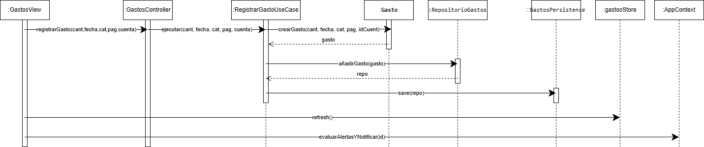

### Historia de Usuario: 1. Registrar Gasto

A continuación, se detalla el flujo de secuencia para el registro de un nuevo gasto. El diagrama evidencia la correcta delegación de responsabilidades: la Vista comunica la acción al `GastosController`, el cual utiliza `RegistrarGastoUseCase` para orquestar la lógica de dominio y la persistencia. Finalmente, el controlador actualiza el estado de la UI y gestiona las notificaciones a través de `AppContext`.