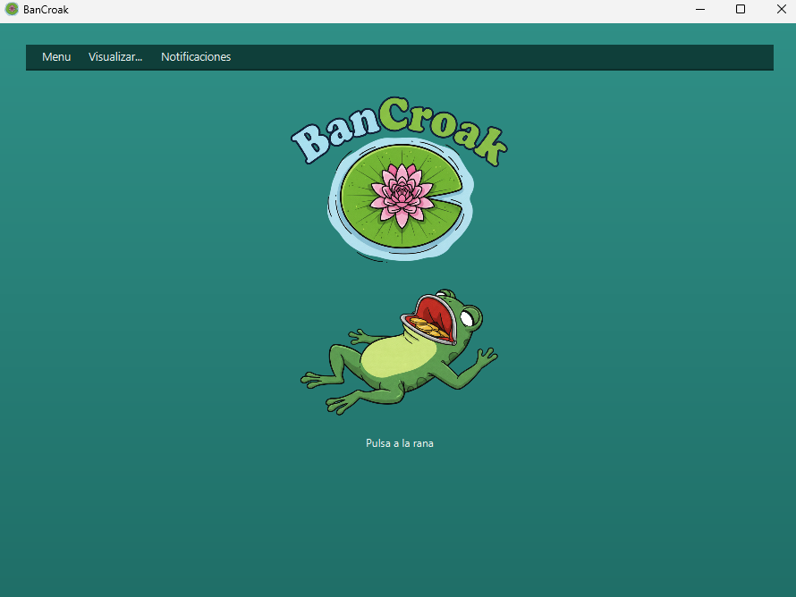
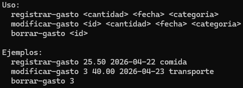

## Requisito Previo

Para que el proyecto funcione, es imprescindible tener instalado el **JDK 21** (o superior) y configurar la variable de entorno `JAVA_HOME`.

---

## Ejecución de la Interfaz Gráfica (GUI)

Para abrir la aplicación con todas las funcionalidades visuales (gráficos, tablas y calendario), ejecuta el siguiente comando en la raíz del proyecto:

**En Windows:**
```cmd
mvnw javafx:run
```
**En Linux/maxOS:**
```cmd
./mvnw javafx:run
```

---

## Ejecución de la Línea de Comandos (CLI)

La CLI permite gestionar gastos rápidamente mediante argumentos. El sistema redirige automáticamente la ejecución de la CLI si detecta parámetros.

Para pasar argumentos a través de Maven, se utiliza la propiedad -Djavafx.args.

Comando | Parámetros | Descripción |
| :--- | :--- | :--- |
| `registrar-gasto` | `<cantidad> <fecha> <categoria>` | Registra un nuevo gasto en la cuenta. |
| `modificar-gasto` | `<id> <cantidad> <fecha> <categoria>` | Actualiza los datos de un gasto existente. |
| `borrar-gasto` | `<id>` | Elimina un gasto del sistema por su ID. |

### Ejemplos de uso:
Registrar un nuevo gasto:
```cmd
mvnw javafx:run -Djavafx.args="registrar-gasto 23.50 2026-04-23 entretenimiento"
```
Modificar un gasto:
```cmd
mvnw javafx:run -Djavafx.args="modificar-gasto 1 10.10 2026-04-26 transporte"
```
Borrar un gasto:
```cmd
mvnw javafx:run -Djavafx.args="borrar-gasto 1"
```
Mostrar ayuda:
```cmd
mvnw javafx:run -Djavafx.args="--help"
```


**NOTA**: Para mejorar la legibilidad de la interfaz de comandos, se recomienda la ejecución en modo silencioso con la flag `-q`.
## Solución de Problemas comunes
* Error "mvnw no se reconoce": Asegúrate de estar en la carpeta raíz del proyecto donde se encuentran los archivos mvnw.

* Error de JAVA_HOME: Si el error persiste tras configurar la variable, verifica que el sistema reconoce Java correctamente.

* Permisos en Linux/Mac: Si ./mvnw no funciona, otorga permisos de ejecución a mvnw.
